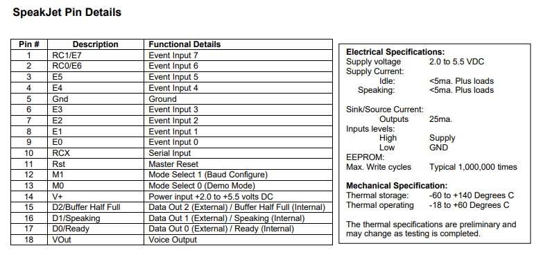
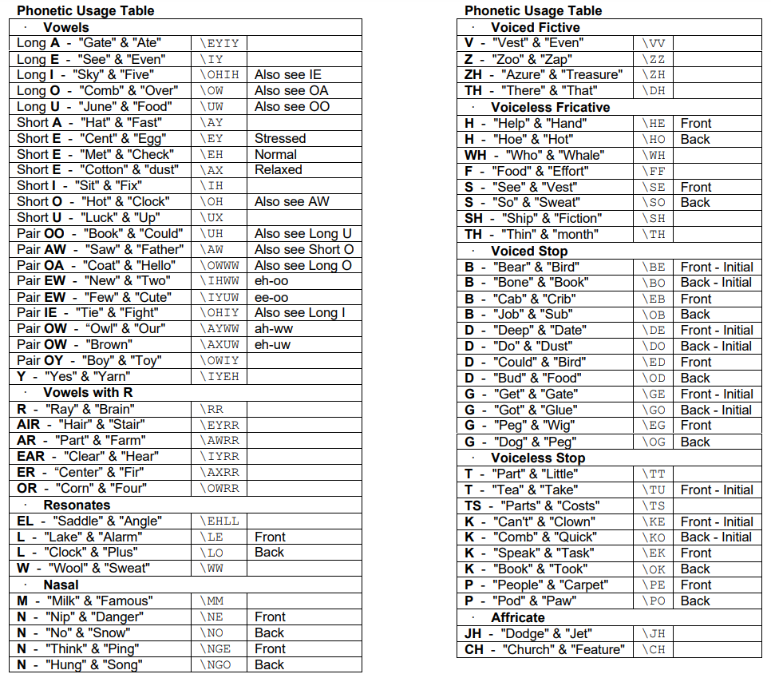
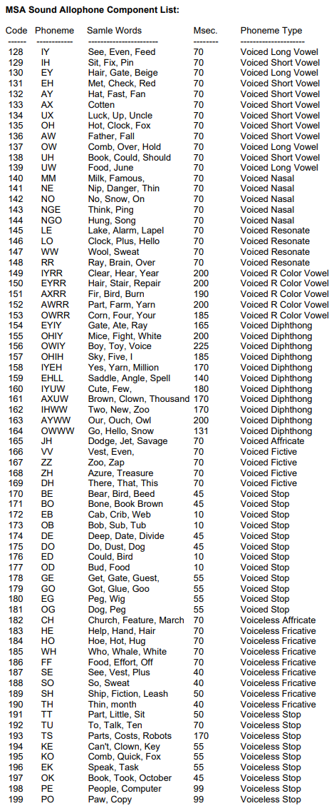
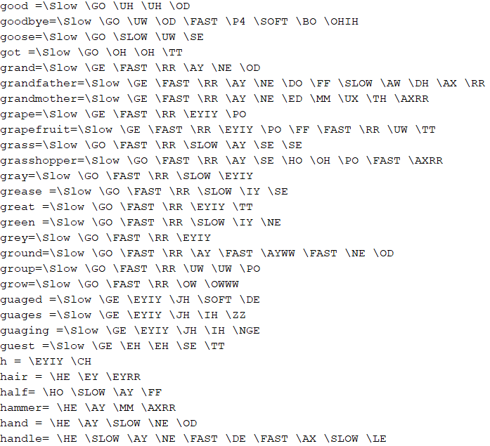

Group Project 2: Hardware Toy Store
###################################
..  vim:ft=rst spell:

**Lab Report: Lambda Group**
============================

Chosen Device Description [Michael Beebower]
============================================
(Source, Basic Features)

Arduino UNO Board Components
----------------------------
* Power Connector
* USB Port
* Reset Button
* TX and RX LEDs
* Digital Pins
* Pin 13 LED
* ATmega Microcontroller
* Power LED
* GND and SV Pins
* Analog In

Parts
-----
* Arduino UNO board
* A B USB cable, sometimes called a "USB printer cable". This powers the UNO board but also sends data to program it. ( `#1b`_ )
* (Optional) DC adapter - 9-12V DC, 250mA or more, 2.1mm plug, center pin positive. This can be used to power the UNO board when not powered by the USB cable or a 9V battery. ( '#2b'_ )
* (Optional) 9V battery - This can be used to power the UNO board when not powered by the USB cable or the DC adapter.
* SparkFun Voice Box Shield (no longer in production)

Controlling the device [Arman Levanti]
======================================
The SpeakJet, while very simple to set-up with an Arduino Uno model, actually requires the use of many of the boards pins.

*Breakdown of the SpeakJet pin connections*

(source: sparkfun.com | `#1a`_ )

* Pins E0-E7 handle "Event Input" signals which oversee the functionality required to produce sounds and effects through the SpeakJet. Each one of these pins can handle a High or Low logic level and that determines what pitch, tone and phrase should be executed.
* The RCX pin is the "Serial Input" and allows for communication between the board and an external device/speaker required for the SpeakJet to function.
* The RST pin serves as a "Master Reset" system that forces the internal control circuit to "reset and clear the input buffer".
* Pins M0/M1 are "Mode Selection" pins and are read when the device is initially powered up. The high or low state of the pins will determine whether the board will start up in "Normal Operation" mode or a "Demo/Test mode". Demo/Test mode is very similar to the standard mode but allows for much more configuration behind the scenes.
* Pins D0/D1/D2 are all "Data Out" pins that control the output of various signals which can give the user insight into how the unit is operating. "Data Out 0" simply indicates when the device is ready to run, this high/low signal is determined after a set of preliminary tests are run on the device and if it's ready to accept data through its input. "Data Out 1" is a signal that simply indicates when the SpeakJet device is actively speaking. "Data Out 2" is an output used as a general-purpose output or a more complex output which can communicate "with a serial port by connecting to the CTS line back to the computer or controller". ( `#1a`_ )
* The "VOut" Pin is the pin which handles the modulation of the SpeakJet's voice produced on the device. The Voice Output "is modulated on a square wave carrier of 32 khz". ( `#1a`_ )

To communicate with the SpeakJet through code you have to pass the device sets of phonetic patterns to form what sounds like English words to the human ear. While this may initially seem like it'd be a huge undertaking for the users to string together complex phonetic variants to create words from scratch, fortunately the SparkFun team provides it user's with detailed documentation and resources regarding these allophone sets that are used.

*Phonetic List of all the sounds supported by the SpeakJet*

(source: sparkfun.com | `#1a`_ )

To actually take advantage of these allophones on the unit, they have assigned each sound a designated 8-bit code. The SpeakJet on runtime will interpret these passed codes and produce the relevant sound as needed. In addition to the list of 8-bit sound codes, there are also 23 8-bit codes that serve as System Commands. These System Command codes can perform useful functions such as telling the board to wait a specified period between words, indicating stress or relaxation on certain sounds, and even telling the board when to slow down or speed up the speech of individual sounds.

*8-bit codes assigned to Phonemes*

(source: sparkfun.com | `#1a`_ )

While it's not that difficult to produce modulated voices with the resources they've provided up to this point, they also have given us another very valuable tool. They compiled a dictionary of sorts that a list of common words and their broken-down, allophone equivalent version. While this list isn't comprehensive, it still provides a lot of good examples on how to "translate" words into the necessary format required for the SpeakJet to interpret them.

*"PhraseALatorDictionary" provided as a resource on the SparkFun website*

(source: sparkfun.com | `#1a`_ )

So going off this dictionary and referencing the 8-bit sound codes provided in the documentation, we were able to begin stringing together our own sentences using the SpeakJet. For example, if I wanted to get the device to say "Hello World", I would look at the dictionary entries for Hello (\HE \FAST \EHLE \LO \OWWW) and World (\WW \AXRR \LE \ED), then reference the allophone chart to get the 8-bit codes associated with each of those phonetic sounds. The SpeakJet takes in arrays of strings to decode, so the SpeakJet compatible equivalent of "Hello World" would be::

	//                Hello			 World
	char message[] = {183, 7, 159, 146, 164, 147, 151, 145, 176};
	
As you can tell this process is pretty tedious when you're attempting to string together full-blown paragraphs worth of words. It's a whole bunch of searching, referencing, cross-referencing and hoping you actually type the correct 8-bit code into the program without making an error at any point of the way. You could probably find a way to program the automation of the conversion of the words found in the dictionary to SpeakJet compliant 8-bit codes fairly easily to reduce the load of the programmer though.

Device Demonstration [Arman Levanti]
====================================
Our demonstration will show a segment of code which will pre-initialize and use the SpeakJet device to modularize sentences that we have specified. This program was very simple to make as SparkFun provides an fragment of example code available on their website. ( `#3a`_ ) This helped to work through the configuration process of initializing the SpeakJet within the program.

Project Code [Arman Levanti]
============================
Most of the code implementation aside from the tedious work of continually referencing the datasheet is actually pretty straightforward. The majority of the code relies on the "SoftwareSerial" library to interact with the Arduino and send it data over serial communication to the pins of the board. ( `#4a`_ ) This block of code initializes the locations of the required pins on the board as well as creates a object of the "SoftwareSerial" library which is supported by the Arduino Uno by default. We use this created 'speakjet' object later on to actually interface with the device and send it data. This code was provided publicly by the SparkFun team inside their documentation repo. ( `#3a`_ ) ::

	//Soft serial library used to send serial commands on pin 2 instead of regular serial pin.
	#include <SoftwareSerial.h>

	//Define the Pin Numbers for the sketch.
	#define E0  5
	#define E1  6
	#define E2  7
	#define E3  8
	#define E4  9
	#define E5  10
	#define E6  11
	#define E7  12

	#define RDY  13
	#define RES  3
	#define SPK  4

	#define txPin  2

	//Create a SoftSerial Object
	SoftwareSerial speakjet = SoftwareSerial(0, txPin); 

The next step in setting up this hardware to work is inside the void setup() function, which further establishes a link between the Arduino and the gadget on runtime. This code was also provided publicly by the SparkFun team. ( `#3a`_ ) ::

	void setup()  
	{
	  //Configure the pins for the SpeakJet module
	  pinMode(txPin, OUTPUT);
	  pinMode(SPK, INPUT);
	  
	  //Set up a serial port to talk from Arduino to the SpeakJet module on pin 3.
	  speakjet.begin(9600);
	  
	  //Configure the Ready pin as an input
	  pinMode(RDY, INPUT);
	  
	  //Configure Reset line as an output
	  pinMode(RES, OUTPUT);
		   
	  //Configure all of the Event pins as outputs from Arduino, and set them Low.
	  for(int i=E0; i<=E7; i++)
	  {
		pinMode(i, OUTPUT);
		digitalWrite(i, LOW);
	  }
	  
	  //All I/O pins are configured. Reset the SpeakJet module
	  digitalWrite(RES, LOW);
	  delay(100);
	  digitalWrite(RES, HIGH);
	}

Next we have the code that specifies what sounds/words should actually be sent to the SpeakJet during runtime. This is pretty simple stuff, just arrays filled with the previously explained 8-bit data codes.::

	char message1[] = {3, 3, 183, 7, 159, 146, 164, 183, 7, 160, 140, 131, 141,
			   184, 8, 163, 152, 8, 160, 8, 191, 139, 174, 154};

       //char message2[] = {3, 8, 169, 8, 129, 187, 5, 8, 129, 167, 5, 154, 128, 5,
			    191, 131, 8, 187, 191, 5, 8, 134, 166, 5, 8, 169, 8, 128,
			    5, 187, 198, 8, 128, 196, 165, 131, 191};

	char message3[] = {3, 8, 169, 8, 129, 187, 5, 191, 131, 8, 187, 191, 5, 8, 129,
			   167, 5, 186, 153, 5, 187, 187, 128, 128, 5, 137, 164, 5, 131,
			   187, 187, 5, 187, 187, 128, 128, 5, 8, 191, 162, 5, 8, 190,
			   148, 8, 128, 5, 8, 191, 162, 5, 186, 157, 166};

	char message4[] = {3, 8, 169, 8, 129, 187, 147, 134, 167, 195, 7, 148, 128, 154,
			   191, 129, 176, 171, 157, 152, 140, 154, 141, 8, 132, 8, 141,
		           177, 140, 157, 197, 154, 159};
	
Lastly, the code that actually drives this device during runtime is inside the void loop() function. This just calls the speakjet SoftwareSerial onject to 'print' the message arrays and essentially execute. The delays present between the call statements prevent the SpeakJet from attempting to "speak over" the line that is currently being spoken.::

	void loop()
	{
	  speakjet.print(message1);
	  delay(3000);
	  speakjet.print(message3);
	  delay(3800);
	  speakjet.print(message4);
	  while(1);
	}

Arman's References
==================
1a. https://www.sparkfun.com/datasheets/Components/General/speakjet-usermanual.pdf

2a. http://www.sparkfun.com/datasheets/Components/General/SpeakJet-dictionary.zip

3a. https://github.com/sparkfun/VoiceBox_Shield/tree/V_1.6

4a. https://www.arduino.cc/en/Reference/SoftwareSerial

.. _#1a: https://www.sparkfun.com/datasheets/Components/General/speakjet-usermanual.pdf
.. _#2a: http://www.sparkfun.com/datasheets/Components/General/SpeakJet-dictionary.zip
.. _#3a: https://github.com/sparkfun/VoiceBox_Shield/tree/V_1.6
.. _#4a: https://www.arduino.cc/en/Reference/SoftwareSerial

Michael's References
====================
1b. https://www.arduino.cc/en/Guide/ArduinoUno
2b. https://playground.arduino.cc/Learning/WhatAdapter/

.. _#1b: https://www.arduino.cc/en/Guide/ArduinoUno
.. _#2b: https://playground.arduino.cc/Learning/WhatAdapter/
