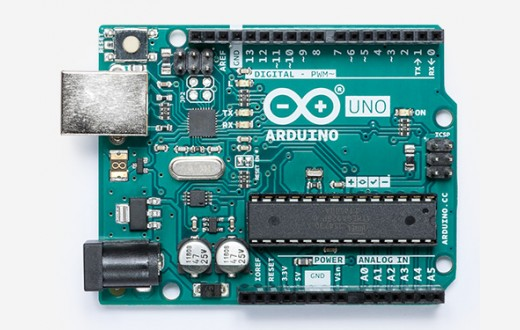

Group Project 2: Hardware Toy Store
###################################
..  vim:ft=rst spell:

**Lab Report: Lambda Group**
============================

Chosen Device Description [Michael Beebower]
============================================
Source: Voice Box Shield model 9799 from SparkFun
-------------------------------------------------

This VoiceBox Shield (model 9799) was sourced from a company called SparkFun. They no longer produce this item or newer versions of the VoiceBox Shield. ( `#1b`_ )

Instead, SparkFun now produces a product called the "Text-to-Speech Module - Emic 2". ( `#2b`_ )

Basic Features: Voice Box Shield model 9799 
-------------------------------------------
* 3.5mm Audio Jack - This makes it easier to connect your VoiceBox Shield to a speaker or other audio output.
* Able to mount on top of Arduino Board
* SpeakJet Voice and Sound Synthesizer
* 'SPK+/-' pins to connect a speaker for audio output
* Serial Line
* 8 event input lines which are connected to digital pins 5-12
* 6 or 8-pin stackable headers for mounting onto Arduino board ( `#1b`_ )

( '#3b'_ )

Source: Arduino UNO Board Rev3
------------------------------

The Arduino UNO Board Rev3 can be purchased from many retailers and websites, but you can purchase directly from the official Arduino website. ( '#4b'_ )

Basic Features: Arduino UNO Board Rev3
--------------------------------------
* Power Connector
* USB Port
* Reset Button
* TX and RX LEDs
* Digital Pins
* Pin 13 LED
* ATmega328p Microcontroller
* Power LED
* GND and SV Pins
* Analog In

Summary of Parts
----------------
* Arduino UNO board Rev3
* SparkFun Voice Box Shield, model 9799
* A B USB cable, sometimes called a "USB printer cable". This powers the UNO board but also sends data to program it. ( `#5b`_ )
* (Optional) DC adapter - 9-12V DC, 250mA or more, 2.1mm plug, center pin positive. This can be used to power the UNO board when not powered by the USB cable or a 9V battery. ( '#6b'_ )
* (Optional) 9V battery - This can be used to power the UNO board when not powered by the USB cable or the DC adapter.

Controlling the device
======================
placeholder
(Required input/output signals)

Device demonstration
====================
placeholder
(How will you show off this device)

Project Code
============
placeholder
(Any code your team authored. SOurces for other parts are fine)

Arman's References
==================
1a.

Michael's References
====================
1b. https://www.sparkfun.com/products/retired/9799
2b. https://www.sparkfun.com/products/11711
3b. https://www.sparkfun.com/products/9279
4b. https://store.arduino.cc/usa/arduino-uno-rev3
5b. https://www.arduino.cc/en/Guide/ArduinoUno
6b. https://playground.arduino.cc/Learning/WhatAdapter/

.. _#1b: https://www.sparkfun.com/products/retired/9799
.. _#2b: https://www.sparkfun.com/products/11711
.. _#3b. https://www.sparkfun.com/products/9279
.. _#4b: https://store.arduino.cc/usa/arduino-uno-rev3
.. _#5b: https://www.arduino.cc/en/Guide/ArduinoUno
.. _#6b: https://playground.arduino.cc/Learning/WhatAdapter/